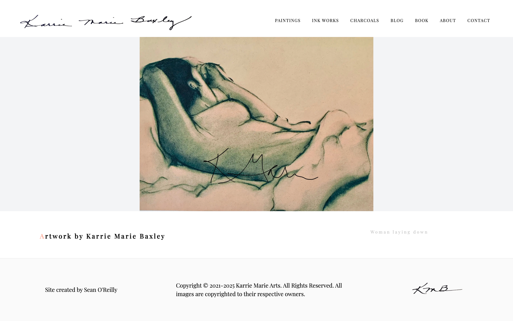

Next JS app generated with [sanity](https://www.sanity.io/), deployed with [vercel](https://vercel.com/), and styled with [TailwindCSS](tailwindcss.com/docs/guides/nextjs).

# [KMB](https://karriemariebaxley.com)

Source code for this artist website ✨

Check the live version [here](https://karriemariebaxley.com) ⚡️



## ⚡️ Features:

Live previews, including website preview for products
Frontend with product pages styled using Tailwind.css
Content types for artwork, blog, social media

## 📦 Made with

- Next JS
- TailwindCSS
- React Icons
- React Image Lightbox
- Sanity CMS
- Email JS

## 💻 Getting Started

Install dependencies:

```bash
npm install
# or
yarn
```

Then, run the development server:

```bash
npm run dev
# or
yarn dev
```

Open [http://localhost:3000](http://localhost:3000) with your browser to see the result.

## Found
This site can be found [here](https://wwww.karriemariebaxley.com)